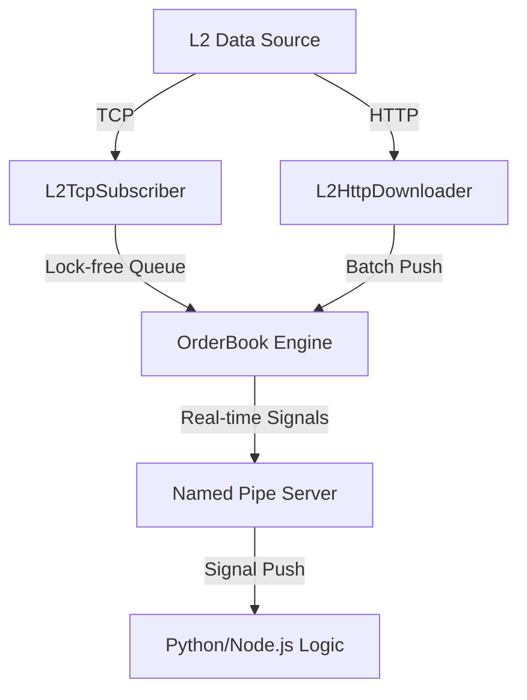

# L2 Realtime Market Engine 🚀

**高性能 Level-2 证券行情实时处理引擎**

[](https://isocpp.org/)
[](https://www.microsoft.com/windows)
[](LICENSE)

---

## 📖 项目简介
**L2 Realtime Market Engine** 是一款专为量化交易设计的**低延迟、高并发**行情处理引擎。它支持上海（SSE）与深圳（SZSE）证券交易所的 Level-2 逐笔委托及成交数据，通过现代 C++ 17 技术栈实现**纳秒级/低微秒级**的数据解析与订单簿（OrderBook）重构。

---

## ✨ 核心特性
*   ⚡ **极致性能**: 基于无锁并发队列（Lock-free Queue），实现单线程 10w+ events/s 处理能力。
*   🏗️ **精准建模**: 完整重构 L2 订单簿，支持实时市场深度（Market Depth）计算。
*   🔗 **跨语言集成**: 通过 Windows 命名管道（Named Pipe）实现与 Python/Node.js 的无损实时通信。
*   📥 **全场景数据**: 支持 TCP 实时订阅与 HTTP 历史数据下载，满足回测与实盘需求。
*   🧠 **智能监控**: 内置涨停撤单、封单分析等量化信号生成器。

---

## 🔬 OrderBook 核心设计
项目核心 `OrderBook` 类采用高度优化的复合数据结构，确保在极高性能下维持市场状态的绝对精确：

### 1. 复合型存储架构
*   **价格优先 (std::map)**: 使用有序映射维护价格档位，利用红黑树特性实现 $O(\log N)$ 的价位检索。
*   **逐笔还原 (L2 Event-Driven)**: 核心逻辑基于交易所 Level-2 原始事件（逐笔委托与逐笔成交）。通过实时匹配成交与委托 ID，实现对分时盘口及其内部排队单的精确还原。
*   **快速索引 (std::unordered_map)**: 存储 `order_id` 到挂单信息的查找索引。

### 2. 双向撮合与异步模型
*   **双向容错匹配**: 项目核心亮点——**委托与成交的双向钩连机制**。无论“先有委托后有成交”还是“成交早于委托到达”（乱序数据），系统均能通过双向缓冲区实现微秒级自动匹配，极大提升了处理乱序行情流的吞吐速度，确保盘口状态实时绝对对齐。
*   **MPSC 消息队列**: 采用 `moodycamel::BlockingConcurrentQueue`，网络接收线程（多生产者）并发压入事件，计算线程（单消费者）顺序处理，彻底消除锁竞争。
*   **状态持久化**: 支持 `AutoSaveJsonMap` 自动保存股票与账户的关联关系，确保进程重启后的状态连续性。

---

## 🏗️ 系统架构


---

## 🚀 快速开始
### 环境要求
*   **操作系统**: Windows 10/11
*   **编译器**: MSVC 2019+ / MinGW-w64 (需支持 C++17)
*   **构建工具**: CMake 3.29+

### 构建与运行
```powershell
# 克隆并进入目录
git clone <your-repo-url>
cd l2-realtime-market-engine

# 编译项目
mkdir build && cd build
cmake ..
cmake --build . --config Release

# 运行程序
cd ../bin
./main.exe
```

---

## 📊 性能指标
| 指标 | 表现 | 备注 |
| :--- | :--- | :--- |
| **单路吞吐量** | > 1,000,000 events/s | 100万条事件处理还原盘口 < 1s |
| **处理延迟** | 1 ~ 5 μs | 单次事件循环处理时间 |
| **内存效率** | ~50MB / 股票 | 包含 10 万档活跃订单 |

---

## 💡 技术亮点
### 1. TCP 与数据路由深度解耦
系统采用经典的“生产者-消费者”模型，将网络通信与逻辑处理彻底分离：
*   **L2TcpSubscriber (网络层)**: 仅负责极速 Socket 接收、登录握手及自动重连。它不感知具体的解析逻辑，只管将原始数据流推送到中间路由。
*   **DataRouter (分发层)**: 核心流量调度中心。它负责处理数据分帧（De-framing）、乱序分拣，并根据股票代码将任务精准分发给对应的 `OrderBook` 实例。
*   **优势**: 极大降低了模块间的耦合。即使网络层出现拥塞或重连，也不会影响已接收数据的处理流水线；由于分发层独立运行场景，可轻松扩展为支持多种协议（如 UDP/WebSocket）的数据输入。

### 2. 无锁并发设计
引入 `moodycamel::BlockingConcurrentQueue` 消除互斥锁开销，最大化多核性能。

### 3. 高性能字符串解析
使用 `std::string_view` 与 `std::from_chars` 实现零拷贝/快速整数转换，比常规方法快 3-5 倍。

### 4. 创新的双向管道
采用命名管道实现跨进程通信，确保 C++ 核心引擎与上层 Python/Node.js 策略层解耦的同时保持低延迟。

---

## 📁 项目结构
*   `include/`: 核心类定义及 Header-only 工具类。
*   `src/`: 核心模块实现（Subscriber, OrderBook, PipeServer 等）。
*   `third_party/`: 内置高性能第三方库依赖。
*   `bin/`: 可执行文件、配置文件及日志输出目录。

---

## 🤝 开源致谢
本项目受益于以下优秀的开源项目：
*   [moodycamel/concurrentqueue](https://github.com/cameron314/concurrentqueue) - 高性能无锁并发队列。
*   [gabime/spdlog](https://github.com/gabime/spdlog) - 极速 C++ 日志库。
*   [yhirose/cpp-httplib](https://github.com/yhirose/cpp-httplib) - 轻量级 HTTP 客户端。

---

## 📜 许可证
本项目采用 [MIT License](LICENSE)。

---

<div align="center">

**专为量化交易打造 🚀**

如有问题或建议，欢迎提交 Issue 或 Pull Request！

</div>
